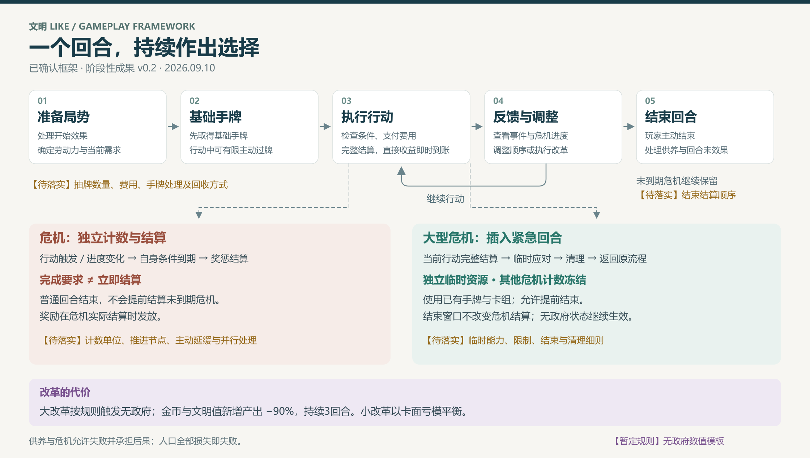

# 文明 Like 卡牌策略游戏

## 核心玩法框架 · 阶段性成果 v0.2

**版本日期：2026年9月10日**  
**内容范围：单回合流程、资源与人口、卡组与改革、危机应对、紧急回合、阶段待办。**

> 设计主张：用有限劳动力执行卡牌行动，以改革调整行动结构，在供养与危机之间作出取舍。
>
> 本文呈现已确认的阶段性框架，并非完整实装规则。尚未确定的内容统一标注 **【待落实】**；已明确用于当前讨论的临时方案标注 **【暂定规则】**。

---

## 01｜玩法定位

本作以文明发展为框架，以卡牌承载主要行动。玩家经营人口和资源，决定行动顺序与投入方向，通过改革调整卡组，并在危机出现时选择应对方式或承担后果。

核心循环：

**人口提供劳动力 → 使用卡牌执行行动 → 获得资源与发展能力 → 应对危机 → 完成供养并继续发展。**

改革改变可参与后续抽取的行动结构；抽牌决定这些行动何时进入玩家可使用的范围。大型危机可插入紧急回合，提供一次受限制的集中应对机会。

玩家的核心决策包括：

1. **资源分配**：有限劳动力投入供养、生产、建设或其他行动。
2. **行动排序**：依据当前手牌与局势，决定先做什么、承担什么风险。
3. **构筑调整**：将适用的牌调入卡组，将暂不需要的牌调入额外卡组。
4. **危机取舍**：选择优先满足的要求，必要时主动承受资源或人口损失。
5. **改革节奏**：在小幅调整与大规模改革之间选择，并评估无政府状态的代价。

供养和危机目标允许不完成，玩家承担相应后果。人口全部因饥饿或危机等原因损失时，游戏失败。

**【待落实】** 大量人口损失后的低效拖延体验，以及如何兼容主动牺牲人口的策略。

## 02｜单回合主流程

普通回合由玩家主动结束；危机具有独立结算条件；紧急回合可以插入后返回。三者相互作用，但不共用一个“结束即全部结算”的规则。

### 2.1 开始阶段：建立当前局势

- 处理适用于回合开始的持续效果，例如疾病、政策、建筑或其他状态。
- 根据当前人口与适用效果确定普通回合可用劳动力。
- 展示人口、食物、供养需求、其他资源，以及仍在持续的危机。
- 按文明水平展示玩家可以获知的信息。

**【待落实】** 同时触发的开始效果顺序、信息展示层级、资源与状态的完整恢复规则。

### 2.2 基础手牌与主动过牌

**已确认方向：先取得基础手牌，普通行动期间通过有限的主动过牌继续获取行动。**

这项确认只确定手牌获取的总体节奏，不确定具体数量、费用、回收或保留规则。主动过牌提供争取其他行动的机会，不承诺必定获得指定解法。

**【待落实】** 基础抽牌的具体时点与数量、主动过牌形式和限制、手牌上限、未出手牌处理、洗牌与回收、抽牌堆耗尽、改革后的抽取过程。

### 2.3 行动阶段：执行卡牌

一次行动按以下逻辑展开：

**选择卡牌及必要目标 → 检查使用条件 → 支付费用 → 执行完整效果 → 反馈结果与卡牌去向。**

- 行动费用与条件由卡面定义，费用可以为0。
- 行动可以获取资源、加工资源、建设、改变劳动力、提供改革机会或触发事件。
- 直接产出在行动结算时即时发放。
- 明确指定为回合末处理的效果，记录到对应节点。
- 卡牌执行后按其规则进入弃牌堆、除外堆或指定区域。

**【待落实】** 卡牌类型的完整字段、复合效果的内部顺序，以及特殊行动的使用条件。

### 2.4 反馈与调整：循环作出决策

每次行动后更新资源、危机进度和可知后果。玩家可以改变出牌顺序、执行改革、继续原计划，或接受某项要求无法完成的后果。

**出牌 → 即时反馈 → 调整安排 → 再出牌**，构成普通回合的主体循环。

反馈与调整不代表存在一个可以免费编辑卡组的独立阶段。调整卡组需要通过改革或其他明确赋予该能力的效果实现。

**【待落实】** 反馈呈现、重复操作的减负方式，以及危机信息出现后的交互衔接。

### 2.5 玩家结束与回合末处理

- 提供独立的 **【结束回合】** 按钮，玩家可以主动提前结束。
- 没有合法操作时按钮高亮，但不自动结束。
- 是否仍有操作，需综合零费牌与其他合法能力，不能只判断劳动力是否为0。
- 结束时处理供养及属于回合末的效果。
- 未到期危机继续保留，不因结束普通回合而提前结算。

**【待落实】** 回合末效果、供养、人口变化、状态移除、资源保存及失败判定的完整顺序。未出手牌的处理不作预设。

## 03｜人口、劳动力与资源

| 要素 | 当前定义 |
| --- | --- |
| 人口 | 基础供养对象，也是基础劳动力来源。扩大人口是提高生产能力的重要途径。 |
| 普通劳动力 | 供普通回合行动使用，由人口和适用效果确定；最低为0，不欠额。 |
| 临时劳动力 | 紧急回合可启用的独立行动资源，退出时未使用部分清零。 |
| 食物 | 用于基础供养，也可参与加工、危机或其他行动。 |
| 金币 | 经济资源，具体用途与购买机制尚未展开。 |
| 文明值 | 文明发展与科技相关资源，具体成长与解锁机制尚未展开。 |

### 3.1 失能与人口损失分别配置

- **劳动力减少**通常对应受伤、疾病等可恢复影响。
- **人口减少**通常对应死亡、失踪等不可恢复损失。
- 危机杀死人口，直接减少当前回合剩余可用劳动力；下一次恢复也依据当前人口。
- 劳动力减至0后不继续产生负数或欠额。

**【待落实】** 具体扣减换算、恢复规则及状态到期是否返还当前劳动力。

### 3.2 产出即时发放，指定效果按节点处理

直接收益在打牌或完成危机结算时发放，不统一压到回合末。供养修正、持续失能等效果分别记录自己的生效时点。

例如，一次野果行动可以同时产生“本回合供养需求降低1”和“本回合剩余劳动力减少1”。前者参与本回合供养计算，后者立即影响剩余行动能力；二者不是同一次延迟产出。

**【待落实】** 供养数值、人口增长、食物储存与盈余处理、资源拆分和消耗溢出、金币的具体用途。

## 04｜卡组结构与抽牌模块

### 4.1 牌区定义

**卡组 = 手牌 + 抽牌堆 + 弃牌堆的整体。**

| 牌区 | 当前用途 |
| --- | --- |
| 手牌 | 当前持有的行动牌；跨回合如何处理由抽牌模块确定。 |
| 抽牌堆 | 抽牌的来源。 |
| 弃牌堆 | 普通牌使用后进入，可通过规定机制返回抽牌体系。 |
| 额外卡组 | 保存可经改革等效果调入、调出的牌。 |
| 除外堆 | 一次性或特殊牌使用后进入，不参与普通洗回；后续可设计专门交互。 |

“可选卡池”“可选卡组”等旧称统一为 **额外卡组**。

### 4.2 抽牌模块的当前边界

已确认“基础手牌＋有限主动过牌”。其余内容继续独立设计，不默认保留未出手牌，不默认抽牌堆耗尽后自动洗回弃牌堆，也不沿用旧教程的每回合5张。

改革与抽牌各自承担不同职责：

- **改革**：改变卡组包含哪些行动。
- **抽牌与过牌**：决定玩家何时能使用这些行动。

**【待落实】** 具体获取节奏、数量、费用、保留与回收规则，以及有限主动过牌如何避免过度循环。

## 05｜改革：调整卡组的入口

改革让玩家在卡组与额外卡组之间调整卡牌，优化当前行动构成，减少无关牌对所需行动的稀释。

### 5.1 双线改革

| 类型 | 识别方式 | 设计方向与代价 |
| --- | --- | --- |
| 大改革 | 专用改革卡 | 调整能力更强，玩家自行决定是否加入卡组；过度使用可能触发无政府。 |
| 小改革 | 其他行动附带的伴生改革 | 轻量微调，通过承载卡牌的价值亏模平衡，不计入大改革触发。 |

“亏模”指将附带改革计入卡牌总价值，在其他收益或费用上作出让步。大小改革由来源区分，不按实际换牌数量重新判级。

### 5.2 操作框架

- 保留三选一结构；参考卡牌中已有发现行动、从额外卡组取牌、移除牌的雏形。
- **【暂定规则】** 换牌功能一次换1张、一换一。
- 改革可以作用于手牌、抽牌堆和弃牌堆。
- 调出卡牌进入额外卡组，调入卡牌原则上进入卡组。
- 特殊优质行动可以允许直接从额外卡组使用行动，按卡面定义。

一换一不改变卡组总张数，尚不能覆盖最终“精简卡组”的全部目标。

**【待落实】** 三选一的完整效果及与交换规则的对应、最终精简方式、费用、调整数量、改革牌数量、卡组容量、伴生改革的亏模幅度。

### 5.3 与抽牌模块的接口

手牌交换曾提出“原牌回到额外卡组，新牌洗入抽牌堆，洗牌后再抽1张”的方案。

**【待落实】** 该方案在抽牌模块中重新定义；本版不将其扩展成统一抽牌规则。

## 06｜危机应对：独立要求与独立结算

危机可以提出资源提交、任务执行、打牌或资源维持等要求，也可以包含正向机遇。文明水平影响玩家可以获知的信息，具体层级尚未展开。

| 参数 | 当前含义 |
| --- | --- |
| 危机指数 | 行动可能触发的危机层级或规模。 |
| 风险度 | 行动触发危机的可能性。 |
| 要求与进度 | 危机需要完成的目标及当前完成情况。 |
| 计数与期限 | 自身结算控制条件，可采用时间、出牌张数等形式。 |
| 结算后果 | 按危机规则执行奖励、损失或其他效果。 |

### 6.1 完成要求不等于立即结算

危机按照自身节点结算。若一次行动完成了危机A要求，同时让危机B计数到期，A不因此立即结算，B按到期条件处理。

普通回合结束时，未到期危机继续保留。玩家可以不完成目标并承担后果，不默认禁止结束回合。

### 6.2 危机时间与普通回合分离

危机使用独立计数框架，不把“回合结束”作为所有危机的统一截止点。停止出牌或提前结束是否会形成可利用的延缓方式，需要专门讨论。

**【待落实】** 危机池、等级、频率、任务与奖惩、具体计数推进、主动延缓、多危机并存、信息可见范围与大型危机定义。

## 07｜紧急回合：大型危机下的集中应对

紧急回合也称额外回合，由危机系统控制，初步用于大型危机。它是普通流程中的一次额外应对窗口。

**当前行动全部结算 → 插入紧急回合 → 执行受限制行动 → 清理临时资源 → 返回原流程。**

- 使用已有手牌和卡组。
- 可以启用独立临时劳动力与卡牌资源能力。
- 可设置时间、行动次数、出牌张数、资源使用量等限制，不限定只有这些形式。
- 其他所有危机计数冻结，集中处理当前目标。
- 行动产生的资源、人口等实际变化影响普通流程，临时劳动力独立核算。
- 允许提前结束；结束应对窗口本身不改变危机的结算机制。
- 退出时未用临时劳动力清零，临时卡牌清理、弃掉。
- 原则上不嵌套触发另一个紧急回合，由危机等级与触发系统限制。
- 无政府状态可以在其中触发，已有无政府状态也继续生效。

**【待落实】** 临时能力与限制的具体参数、目标危机计数、临时卡牌清理去向、各类结束条件和返回流程的结算细节。

## 08｜无政府状态：大改革的阶段性代价

### 8.1 触发条件

- 连续两个普通玩家回合进行大改革。
- 同一普通回合连续进行两次大改革。
- 额外回合中连续两次大改革；仅一次不触发。
- 小改革不计入上述大改革判定。
- 已有无政府状态进入额外回合后继续生效。

### 8.2 初始模板

**【暂定规则】** 以下为已确认的初始数值模板，后续可以通过测试调整。

| 参数 | 数值或效果 |
| --- | --- |
| 金币新增产出 | 降低90%，保留10%。 |
| 文明值新增产出 | 降低90%，保留10%。 |
| 持续时间 | 3个回合。 |
| 已有库存 | 不因本项减产效果直接扣减。 |
| 食物与劳动力 | 不纳入本模板的直接减产范围。 |
| 额外回合 | 状态和减产效果继续保持。 |

玩家即将触发无政府时，UI先提示损失与持续时间，由玩家决定是否继续。

**【待落实】** “连续两次”的计数口径、普通与额外回合计数衔接、触发当回合如何计时、额外回合对剩余时间的影响、重复触发、小数处理。

## 09｜建设与文明发展接口

建造作为独立行为模块继续讨论。当前方向是按卡面描述，将若干张牌洗入卡组，或放入额外卡组；其中可能包含一次性牌。

文明值、科技、政策与时代变化预留为发展模块。它们可以与资源、卡牌和危机信息展示建立联系，但具体功能尚未定型。

**【待落实】** 建造的行为形式、成本和效果，科技与政策的解锁、生效及时代变化机制。原教程中的火塘示例不视为固定建造流程。

## 10｜玩家体验目标

本阶段希望形成这样的单回合体验：

**看懂当前局势 → 做出可执行安排 → 行动得到反馈 → 根据变化作出取舍 → 看见本回合成果。**

玩家继续游戏的动力，可以来自更明确的下一步意图：改善供养、尝试新行动、完成危机要求或调整发展方向。这些属于体验目标，尚不能当作经过验证的玩家反馈。

**【待落实】** 通过实际单回合推演与试玩，验证选择是否有效、改革是否可接触、危机压力是否可理解、额外回合是否打断节奏，以及失败后是否出现低效拖延。

## 11｜阶段待办

处理顺序保持 **T01 → T02 → …… → T15**。本版记录的是框架成果，不把已确认方向等同于整个模块完成。

| 编号 | 模块 | 当前状态与下一步 |
| --- | --- | --- |
| T01 | 抽牌 | 已确认基础手牌＋有限主动过牌；【待落实】数量、费用、手牌处理、回收、洗牌及改革接口。 |
| T02 | 人口与供养 | 【待落实】供养数值、增长机制、人口损失、劳动力换算与恢复。 |
| T03 | 食物与资源 | 【待落实】储存、剩余资源、拆分、消耗、加工与金币用途。 |
| T04 | 改革卡 | 【待落实】三选一细则、大小改革能力、费用、最终精简、容量与亏模。 |
| T05 | 危机生成与任务 | 【待落实】危机池、等级、风险、频率、目标、奖惩与信息展示。 |
| T06 | 危机计数与应对 | 【待落实】计数单位、推进节点、主动延缓及多危机取舍。 |
| T07 | 紧急回合 | 【待落实】临时能力、限制、目标计数、清理去向与结束条件。 |
| T08 | 统一结算 | 【待落实】多效果与多危机顺序、供养、状态移除及失败判定。 |
| T09 | 无政府计数 | 【待落实】连续判定、跨流程计数与再次触发。 |
| T10 | 无政府数值结算 | 【待落实】持续时间起算、额外回合计时、小数和重复触发。 |
| T11 | 建造 | 【待落实】行为形式、成本、效果、卡牌投放与一次性牌。 |
| T12 | 文明发展 | 【待落实】文明值、科技、政策、时代变化及解锁接口。 |
| T13 | 受挫后的低效拖延 | 【待落实】大量人口损失后的游戏体验，兼容策略性牺牲；重新讨论方案。 |
| T14 | UI与体验 | 【待落实】资源与危机反馈、信息边界、紧急切换、无政府提示和操作节奏。 |
| T15 | 文档与卡牌统一 | 【待落实】时间用语、旧卡牌、旧教程及后续规则的一致性。 |

详细勾选与讨论区见同包文件《05-阶段待办清单.md》。

## 12｜版本与资料说明

### 本版整合重点

- 更新脑图的阶段结构，明确普通回合、独立危机结算与紧急回合的关系。
- 将“反馈与调整”整理为行动中的循环。
- 纳入新确认的“基础手牌＋有限主动过牌”方向；未出手牌处理仍未确定。
- 统一额外卡组名称，明确卡组包含手牌、抽牌堆与弃牌堆。
- 明确大改革与小改革按来源区分，并加入现行无政府触发条件。
- 将无政府模板明确为金币与文明值新增产出降低90%，持续3回合。
- 将所有尚未确定的设计直接标注为【待落实】。

### 资料边界

本版依据单回合脑图的两次版本、早期教学讨论稿、卡牌样例及后续明确确认的规则整合。早期教程中的人口、抽牌和生产周期数值不自动继承。外部参考游戏提供设计启发，不替代本作已确认规则。

完整脑图见《03-核心玩法脑图.png》；矢量版本与可导入Xmind的提纲用于继续维护。文档和脑图均为本作阶段性设计说明，不宣称已有可玩版本、平衡验证或测试结果。
